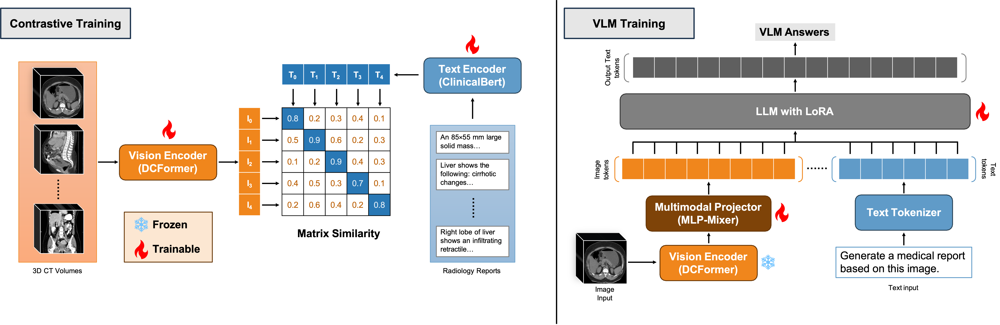

# Med3DVLM: An Efficient Vision-Language Model for 3D Medical Image Analysis

<font size=3><div align='center' > <a href=https://ieeexplore.ieee.org/document/11145341/>**Paper**</a> | [**Datasets**](#datasets) | [**Model**](#model) | [**Training**](#training) | [**Evaluation**](#evaluation) | [**Demo**](#demo)</div></font>

Official PyTorch implementation of: 

[Med3DVLM: An Efficient Vision-Language Model for 3D Medical Image Analysis](https://ieeexplore.ieee.org/document/11145341)



Vision-language models (VLMs) have shown promise in 2D medical image analysis, but extending them to 3D remains challenging due to the high computational demands of volumetric data and the difficulty of aligning 3D spatial features with clinical text. We present Med3DVLM, a 3D VLM designed to address these challenges through three key innovations: (1) DCFormer, an efficient encoder that uses decomposed 3D convolutions to capture fine-grained spatial features at scale; (2) SigLIP, a contrastive learning strategy with pairwise sigmoid loss that improves image-text alignment without relying on large negative batches; and (3) a dual-stream MLP-Mixer projector that fuses low- and high-level image features with text embeddings for richer multi-modal representations. We evaluate our model on the M3D dataset, which includes radiology reports and VQA data for 120,084 3D medical images. Results show that Med3DVLM achieves superior performance across multiple benchmarks. For image-text retrieval, it reaches 61.00% R@1 on 2,000 samples, significantly outperforming the current state-of-the-art M3D model (19.10%). For report generation, it achieves a METEOR score of 36.42% (vs. 14.38%). In open-ended visual question answering (VQA), it scores 36.76% METEOR (vs. 33.58%), and in closed-ended VQA, it achieves 79.95% accuracy (vs. 75.78%). These results highlight Med3DVLM’s ability to bridge the gap between 3D imaging and language, enabling scalable, multi-task reasoning across clinical applications.

## Requirements
* Python==3.12.8
* torch==2.6.0
* torchvision==0.21.0
* monai==1.4.0
* deepspeed==0.16.3

## Installation
First, clone the repository to your local machine:
```bash
git clone https://github.com/mirthAI/Med3DVLM.git
cd Med3DVLM
```
To install the required packages, you can use the following command:
```bash
conda create -n Med3DVLM -f env.yaml
conda activate Med3DVLM
```
or
```bash
pip install -r requirements.txt
```

You need to set the `PYTHONPATH` environment variable to the root directory of the project. You can do this by running the following command in your terminal:

```bash
export PYTHONPATH=$(pwd):$PYTHONPATH
```

## Datasets
In the paper, we train and evaluate our model on report generation and vision question answering tasks using the M3D-Cap and M3D-VQA datasets.

 Dataset  | Type | Images | Texts | Download Link |
| ------------- | ------------- | ------------- | ------------- | ------------- |
| M3D-Cap | 3D image-text pairs |	120,092 | 42,496 | [HuggingFace](https://huggingface.co/datasets/GoodBaiBai88/M3D-Cap), [ModelScope](https://www.modelscope.cn/datasets/GoodBaiBai88/M3D-Cap) |
| M3D-VQA | 3D images, questions, and answers |	96,170 | 509,755 | [HuggingFace](https://huggingface.co/datasets/GoodBaiBai88/M3D-VQA), [ModelScope](https://www.modelscope.cn/datasets/GoodBaiBai88/M3D-VQA) |

The datasets should be downloaded and placed in the `data` folder of the project. The directory structure should look like this:

```bash
│
├── data
│   ├── M3D-Cap
│   └── M3D-VQA
│
├── other folders
│
└── other files
```

### Prepare data
Use the following command to download the datasets and convert them into 128x256x256 NIfTI format:

```bash
python utls/m3d_cap_data_prepare_128.py
```

The directory structure after data preparation should look like this:

```bash
│
├── data
│   ├── M3D-Cap
│   ├── M3D_Cap_npy
│   └── M3D-VQA
│
├── other folders
│
└── other files
```

After data preparation, you need use the following command to edit all the original CSV files from the M3D-Cap and M3D-VQA datasets:

```bash
python utls/rename_csv.py --csv_path path_to_csv_file
```

## Model

| Model    | Download Link                                                                                                                                 |
|----------|-----------------------------------------------------------------------------------------------------------------------------------------------|
| DCFormer_SigLIP | [HuggingFace](https://huggingface.co/MagicXin/DCFormer_SigLIP) |
| Med3DVLM-Qwen-2.5-7B | [HuggingFace](https://huggingface.co/MagicXin/Med3DVLM-Qwen-2.5-7B) |

## Training

### Contrastive Learning
To train the contrastive learning model, use the following command:

```bash
sh scripts/train_clip.sh
```

You can use our pre-trained DCFormer-SigLIP model. The pre-trained model weights need to be placed in the `output` folder.

### VLM Pre-training
To pre-train the VLM model, use the following command:

```bash
sh scripts/pretrain_mm_projector.sh
```

### VQA Fine-tuning
To fine-tune the VLM model, use the following command:

```bash
sh scripts/finetune_lora.sh
```

To merge the LoRA weights, use the following command:

```bash
sh scripts/merge_lora_weights_and_save_hf_model.sh
```

The model will be saved in the `models` folder.


## Evaluation
To evaluate the model, you need finish the data preparation first. 

### Image-Text Retrieval
To evaluate the image-text retrieval task, use the following command:
```bash
sh scripts/eval_clip.sh
```

### Report Generation
To evaluate the report generation task, use the following command:

```bash
sh scripts/eval_caption.sh
```

### VQA Evaluation
To evaluate the VQA task, use the following command:

```bash
sh scripts/eval_vqa.sh
```

## Demo
We provide two demo scripts for using the model for inference.

### Run in the terminal
```bash
python scr/demo/demo.py --model_name_or_path path_to_model --image_path path_to_image --question "Describe the findings of the medical image you see."
```

### Run online
```bash
python app.py
```

## References
The code is mainly adapted from [M3D](https://github.com/BAAI-DCAI/M3D).


## Citations and Acknowledgements
The code is only for research purposes. If you have any questions regarding how to use this code, feel free to contact Yu Xin at yu.xin@ufl.edu.

Kindly cite the following papers if you use our code.

```bibtex
@article{xin2025med3dvlm,
  title={Med3DVLM: An Efficient Vision-Language Model for 3D Medical Image Analysis},
  author={Xin, Yu and Ates, Gorkem Can and Gong, Kuang and Shao, Wei},
  journal={IEEE Journal of Biomedical and Health Informatics},
  year={2025}
}

@article{ates2025dcformer,
  title={DCFormer: Efficient 3D Vision-Language Modeling with Decomposed Convolutions},
  author={Ates, Gorkem Can and Gong, Kuang and Shao, Wei},
  journal={arXiv preprint arXiv:2502.05091},
  year={2025}
}

@article{tolstikhin2021mlp,
  title={Mlp-mixer: An all-mlp architecture for vision},
  author={Tolstikhin, Ilya O and Houlsby, Neil and Kolesnikov, Alexander and Beyer, Lucas and Zhai, Xiaohua and Unterthiner, Thomas and Yung, Jessica and Steiner, Andreas and Keysers, Daniel and Uszkoreit, Jakob and others},
  journal={Advances in neural information processing systems},
  volume={34},
  pages={24261--24272},
  year={2021}
}

@inproceedings{zhai2023sigmoid,
  title={Sigmoid loss for language image pre-training},
  author={Zhai, Xiaohua and Mustafa, Basil and Kolesnikov, Alexander and Beyer, Lucas},
  booktitle={Proceedings of the IEEE/CVF international conference on computer vision},
  pages={11975--11986},
  year={2023}
}
```
